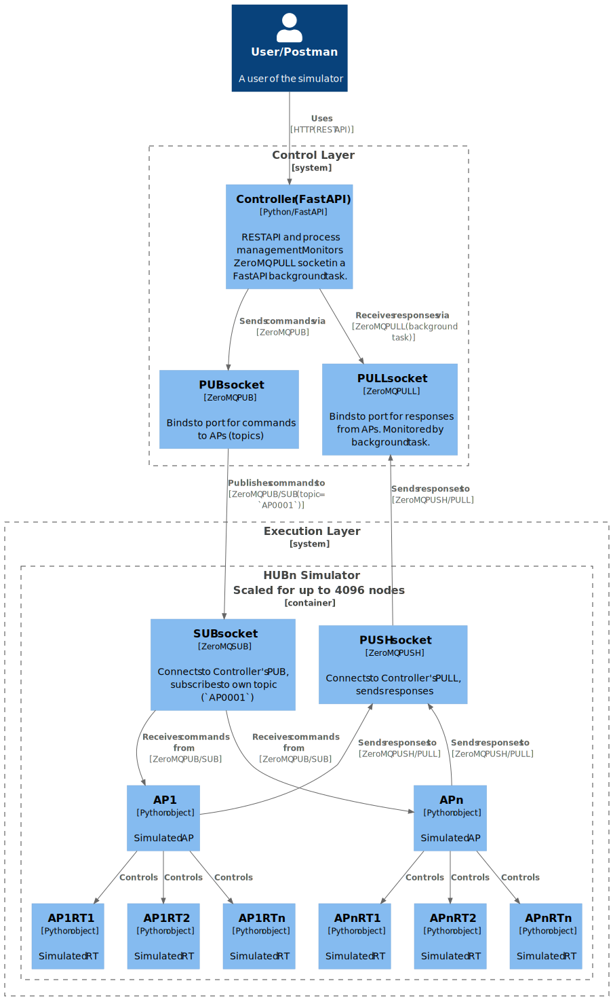

# Network Simulator

## Purpose

A lightweight simulator that models multiple Hubs, each with multiple Access Points (APs) and their Remote Terminals
(RTs), interacting with an NMS Application Under Test (AUT).

## Architecture/Tech Stack

- **Control Plane:** FastAPI (Python)
  - REST API for user interaction (create/delete Hubs/APs/RTs, trigger alarms
  - Manages registration of networks and hubs
- **Process Management:**
  - Local: Python multiprocessing, 1 process per Hub
  - Remote: paramiko/fabric (SSH-based process launch) (for future study) **Inter-process Communication:** ZeroMQ
    (PUB/SUB for commands, PUSH/PULL for responses), served from the control API server
- **Hub Simulator:** Python process simulating a single Hub and its APs/RTs. Each Hub process runs:
  - **Async Runtime:** asyncio event loop
  - **AP Actors:** Each AP is an asyncio Task managed by the Hub actor, handling AP-level logic, registration, and
    alarms
  - **RT Actors:** Each RT is an asyncio Task managed by its AP actor, handling registration, periodic status updates,
    and RT-level alarms
- **Outbound HTTP:** aiohttp sessions inside each Hub simulator process
- **Data Storage:** In-memory for state persistence.
- **Scale**:
  - 1 network (future: multiple networks)
  - Up to 75 Hubs per Control Plane instance (1 process per Hub)
  - Up to 32 APs per Hub
  - Up to 64 RTs per AP
  - Total RTs per network: 75 hubs × 32 APs × 64 RTs = 153,600 RTs per network
  - Total APs per network: 75 hubs × 32 APs = 2,400 APs per network

Scripting/configuration of this system should be possible using postman, but there should be a way of loading a
pre-defined configuration (e.g. JSON file) to create a large number of Hubs/APs/RTs in one go.



## Control Plane

- Support high scalability (50,000+ nodes) using multiple workers (future-proof).
- Dynamic Hub/AP/RT creation and deletion at runtime.
- Configurable heartbeat intervals per Hub and AP.
- Allow scripting and bulk configuration via API or config file (inc config saving from current state).
- Heirarchical data model:
  - Network
    - Hub
      - Access Point (AP)
        - Remote Terminal (RT)
  - All entities have unique IDs and indices within their parent scope. All entities are addressable via API using
    either ID or index.
  - Provides API endpoints for:
    - Creating/deleting Networks, Hubs, APs, RTs
    - Configuring heartbeat intervals
    - Triggering alarms at Hub, AP, or RT level (specific IDs or percentage sampling)
    - Querying status of all entities
  - Provides zeroMQ PUB/SUB socket for sending commands to Worker process.
  - Provides zeroMQ PUSH/PULL socket for receiving status updates from Worker process.

## Worker (Hub Simulator) tasks

- Simulates all APs & RTs for a single hub
- Can scale to up to 32 APs and 64 RTs per AP (2048 RTs per Hub) on a single process.
- Simulate node registration and AP/RT heartbeats and alarm events.
- Aggregate and report status for all APs, and RTs at 1 Hz.
- Handle commands from Control Plane (create/delete APs/RTs, trigger alarms) sent via ZeroMQ subscription socket.
- Send status updates back to Control Plane via ZeroMQ push socket.

### IP addess simulation

Each worker will support simulated AP/RT web server endpoints for NMS to poll/query. Each AP and RT will have its own
IPv6 address, generated dynamically from a common prefix using network/hub/ap/rt index as follows, assuming a /64 or
larger prefix:

- APs: <prefix>::net_index:hub_index:ap_index:ffff
- RTs: <prefix>::net_index:hub_index:ap_index:rt_index

## API Contract (examples)

- `POST /hub` — Create a Hub (with optional APs and RTs)
- `POST /hub/{hub_id}/ap` — Add APs to a Hub
- `POST /hub/{hub_id}/ap/{ap_id}/rt` — Add RTs to an AP
- `POST /hub/{hub_id}/alarm` — Trigger alarms at Hub level
- `POST /hub/{hub_id}/ap/{ap_id}/alarm` — Trigger alarms at AP or RT level
- `GET /hub` — List all Hub statuses
- `DELETE /hub/{hub_id}` — Remove a Hub and its APs/RTs

## Constraints

- All operations must be possible at runtime (no restarts).
- Heartbeat and status aggregation must not block other operations.
- System must be testable and scriptable (e.g., via Postman or pytest).
- Must support both local and remote Hub simulation (future-proof).

## Build Instructions

Before running tests or using the simulator, you must set up your Python environment and build the C++ extension module
(accel) using CMake. This is required for the Python bindings to function.

### 1. Set Up Python Environment

It is recommended to use a virtual environment:

```bash
python -m venv .venv
source .venv/bin/activate
pip install -r requirements.txt
# If developing or running tests, also:
pip install -r requirements-dev.txt
```

### 2. Install System Dependencies

Make sure you have the following system packages installed:

```bash
sudo apt install -y build-essential cmake clang-tidy cppcheck pybind11-dev python3-dev
```

- C++ compiler with C++23 support (e.g., g++ 13+, clang 16+)
- CMake 3.15+
- pybind11 (dev headers)
- **clang-tidy**: Enforced globally by CMake during build (required)
- **cppcheck**: Available as a custom target (optional, run manually)

### 3. Build the C++ Extension (and the documentation diagrams))

From the project root:

```bash
cmake -S . -B build
cmake --build build
cmake --install build
```

or alternatively, using CMake's build command:

```bash
cmake -S . -B build && cmake --build build --target install -- -j$(nproc)
```

This will build the `accel` extension and install it into `src/worker/` as required by the Python code and tests.

#### Static Analysis

- **clang-tidy** is enforced globally by CMake during the build process. If clang-tidy is not installed, CMake will
  fail.
- **cppcheck** is available as a custom target. To run cppcheck manually on the C++ sources:

```bash
cd build
make cppcheck
```

## Testing

- Tests are run using `PYTHONPATH=. pytest --maxfail=3 -v`
- Unit tests for API endpoints and core logic.
- Integration tests simulating various scenarios (e.g., high load, alarm conditions).
- Performance tests to validate scalability.
- Code coverage target: 95%+.

## Example Scenario

1. User creates 10 Hubs, each with 64 APs and 64 RTs.
2. User triggers a 25% RT alarm on AP 3 of Hub 1.
3. User deletes Hub 5; all its APs and RTs are removed.
4. System continues to aggregate and report status for remaining Hubs/APs/RTs.

## Output

- All API responses must be JSON.
- Status endpoints must return up-to-date heartbeat and alarm state for each Hub/AP/RT.

## Capabilities

- Create / delete Hubs and APs dynamically
- Configure per-Hub and per-AP heartbeat interval
- Create initial RTs with AP or add more later
- RT & AP registration logic stubs (POST to AUT endpoints)
- Hub-level alarms
- AP-level alarms
- RT-level alarms (specific IDs or percentage sampling)
- Status aggregation (1 Hz) from worker → control API
- Test-friendly DB session dependency for overrides

## Directory Layout

```
├── CMakeLists.txt                  # CMake build config (root)
├── Dockerfile                      # Container build for the main simulator
├── node_sim.py                     # Main simulator script
├── pyproject.toml                  # Python build config (main)
├── README.md                       # Project overview and docs
├── requirements-dev.txt            # Dev dependencies (main)
├── requirements.txt                # Runtime dependencies (main)
├── accel/                          # C++/Python acceleration module
│   ├── CMakeLists.txt                  # CMake build config for accel
│   ├── README.md                       # Docs for accel module
│   ├── requirements-dev.txt            # Dev dependencies for accel
│   ├── build/                          # CMake build artifacts
│   ├── cmake-build-debug/              # Debug build artifacts
│   ├── src/                            # C++ source for AP/RT/node
│   │   ├── ap.cpp, ap.hpp, ...         # AP, RT, node C++ code
│   │   ├── node_sim_bindings.cpp       # Python bindings for nodes
│   │   └── accel.cpython-311-x86_64-linux-gnu.so # Compiled Python extension module for acceleration (generated)
├── docs/                           # Documentation and architecture diagrams
│   ├── *.puml, *.svg                   # PlantUML and SVG diagrams
│   ├── requirements.md                 # Project requirements and notes
├── experimental/                   # Experimental sub-projects and demos
│   ├── multi-ip/                   # Large-scale IPv6 AP/RT simulation demo
│   │   ├── check_ipv6_which_ip.py      # Check IPv6 address assignment
│   │   ├── docker-compose.yaml         # Compose file for multi-container sim
│   │   ├── Dockerfile                  # Container for multi-ip demo
│   │   ├── entrypoint.sh               # Entrypoint script for containers
│   │   ├── gen_compose.py              # Generate docker-compose for scale
│   │   ├── main.py                     # Main FastAPI server for demo
│   │   ├── README.md                   # Docs for multi-ip experiment
│   │   └── requirements.txt            # Python deps for multi-ip demo
│   └── zmq/                        # ZeroMQ communication demo
│       ├── zmq_client.py               # Minimal ZeroMQ client
│       └── zmq_server.py               # Minimal ZeroMQ server
├── src/                            # Main Python source code
│   ├── __init__.py                     # Marks src as a package
│   ├── config.py                       # Config loading/utilities
│   ├── nms_api.py                      # NMS API integration
│   ├── controller/                     # Control plane logic
│   │   ├── __init__.py                 # Marks controller as a package
│   │   ├── app.py                      # Main FastAPI application setup and lifecycle management
│   │   ├── comms.py                    # Manages ZeroMQ communication between controller and workers
│   │   ├── ctrl_api.py                 # API request/response models for controller endpoints
│   │   ├── managers.py                 # Controller-side node and manager classes
│   │   ├── routes_ap.py                # API routes for Access Point (AP) management
│   │   ├── routes_hub.py               # API routes for Hub management
│   │   ├── routes_network.py           # API routes for Network management
│   │   └── worker_ctrl.py              # Manages communication with worker processes via ZeroMQ
│   ├── worker/                         # Worker process logic
│   │   ├── __init__.py                 # Marks worker as a package
│   │   ├── ap.py                       # Defines the Access Point (AP) class and registration logic
│   │   ├── comms.py                    # Manages ZeroMQ communication between worker and controller
│   │   ├── node.py                     # Base class for all network nodes (APs and RTs)
│   │   ├── rt.py                       # Defines the Remote Terminal (RT) class and state/communication logic
│   │   ├── utils.py                    # Utility functions and helpers for worker nodes
│   │   ├── worker.py                   # Main worker process managing APs, RTs, and controller communication
│   │   └── worker_api.py               # Data models for messages and addresses exchanged with the controller
├── templates/                      # Template files
│   └── template.py
├── tests/                          # Unit and integration tests
│   ├── conftest.py, test_*.py          # Test modules
├── utils/                          # Utility scripts
│   ├── allocate_ipv6.sh
│   ├── async_create_nodes 1.py
│   ├── ipv6_prefix.py
│   └── plantuml.jar
```

## Quick Start (Local Dev)

```bash
python -m venv .venv
source .venv/bin/activate
pip install -r requirements.txt
uvicorn control.app:app --reload
```

Control API: http://localhost:8000

(Optional) Start a mock AUT (httpbin via docker-compose) for basic endpoint hit validation.

## Core Endpoints

| Method | Path                        | Purpose                                                    |
| ------ | --------------------------- | ---------------------------------------------------------- |
| POST   | /hub                        | Create & start a Hub (optionally with initial APs and RTs) |
| GET    | /hub                        | List statuses of all Hubs                                  |
| GET    | /hub/{hub_id}               | Get status for a single Hub                                |
| POST   | /hub/{hub_id}/ap            | Add APs to an existing Hub                                 |
| POST   | /hub/{hub_id}/ap/{ap_id}/rt | Add RTs to an AP                                           |
| POST   | /hub/{hub_id}/alarm         | Trigger Hub-level or AP-level alarms                       |
| DELETE | /hub/{hub_id}               | Stop and remove a Hub and all underlying APs and RTs       |

### Example: Create a Hub

```bash
curl -X POST http://localhost:8000/hub \
  -H "Content-Type: application/json" \
  -d '{
    "hub_id": "1",
    "aut_base_url": "http://localhost:8080",
    "heartbeat_seconds": 10,
    "ap_count": 5,
    "rt_count": 10
  }'
```

### Add APs to a Hub

```bash
curl -X POST http://localhost:8000/hub/{hub_id}/aps \
  -H "Content-Type: application/json" \
  -d '{"add": 3}'
```

### Add RTs to an AP

```bash
curl -X POST http://localhost:8000/hub/{hub_id}/ap/{ap_id}/rts \
  -H "Content-Type: application/json" \
  -d '{"add": 5}'
```

### Trigger Alarms

Hub-level:

```bash
curl -X POST http://localhost:8000/hub/{hub_id}/alarm \
  -H "Content-Type: application/json" \
  -d '{"target":"hub"}'
```

AP-level:

```bash
curl -X POST http://localhost:8000/hub/{hub_id}/ap/{ap_id}/alarm \
  -H "Content-Type: application/json" \
  -d '{"target":"ap"}'
```

25% of RTs:

```bash
curl -X POST http://localhost:8000/hub/{hub_id}/ap/{ap_id}/alarm \
  -H "Content-Type: application/json" \
  -d '{"target":"rt","percent":25}'
```

Specific RT IDs:

```bash
curl -X POST http://localhost:8000/hub/{hub_id}/ap/{ap_id}/alarm \
  -H "Content-Type: application/json" \
  -d '{"target":"rt","rt_ids":[0,2,5]}'
```

### Delete a Hub

```bash
curl -X DELETE http://localhost:8000/hub/{hub_id}
```

## Scaling Roadmap

1. Current: Single worker, many Hub actors (sufficient for dev / moderate load).
2. Multi-worker: Shard Hubs across processes via hashing (extend WorkerManager).
3. External transport: Replace MP queues with Redis / NATS / RabbitMQ if multi-host.
4. Metrics: Add Prometheus exposition in control process.
5. Logging: Introduce structured JSON logs and correlation IDs.
6. High-scale timers: Move heartbeats to a central scheduler / timer wheel.

# Experimental work

The `experimental/` folder contains two sub-projects:

## 1. multi-ip

This sub-project demonstrates large-scale AP/RT simulation using unique IPv6 addresses for each node. It includes:

- A `docker-compose.yaml` that sets up a network with multiple containers, each simulating one AP with many RTs (each RT
  and AP gets a unique IPv6 address).
- A FastAPI server that connects to all simulated IP addresses and provides a `/which_ip` endpoint to verify correct
  address assignment.
- Helper scripts:
  - `gen_compose.py`: Generates the `docker-compose.yaml` file based on the desired number of APs and RTs.
  - `test_ipv6_which_ip.py`: Sends requests to all simulated APs to check that the `/which_ip` endpoint returns the
    correct IP address.

**Performance Note:** Handling very large numbers of IPv6 addresses requires increasing the garbage collection
thresholds for the IPv6 neighbor cache. See the sysctl configuration below for details.

## 2. zmq

This sub-project provides a minimal demonstration of ZeroMQ-based communication, which is used for inter-process
messaging in the main simulator. It includes:

- `zmq_server.py`: A simple ZeroMQ server for receiving messages.
- `zmq_client.py`: A client for sending messages to the server.

These scripts can be used to test and validate the ZeroMQ PUB/SUB and PUSH/PULL patterns that are foundational to the
simulator's architecture.

______________________________________________________________________

**IPv6 Neighbor Cache Configuration:**

To handle large numbers of IPv6 addresses, add the following lines to your `/etc/sysctl.conf` file:

```bash
net.ipv6.neigh.default.gc_thresh1 = 262144
net.ipv6.neigh.default.gc_thresh2 = 524288
net.ipv6.neigh.default.gc_thresh3 = 1048576
```

Or apply them at runtime:

```bash
sudo sysctl -w net.ipv6.neigh.default.gc_thresh1=262144
sudo sysctl -w net.ipv6.neigh.default.gc_thresh2=524288
sudo sysctl -w net.ipv6.neigh.default.gc_thresh3=1048576
```

**Performance considerations:**

Adding many IPv6 addresses to the system is not without its performance considerations. When using a large number of
IPv6 addresses the host kernel actually takes some time to honour the IP assignments requested by the guest containers.

The way we detect this is by setting the health check for each container to ping the `/which_ip` endpoint of the last IP
address assigned to the container (which is the last RT in the container).

## Pre-requisites

```bash
sudo apt install -y clang-format clang-tidy cppcheck pybind11-dev
```
